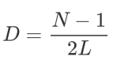
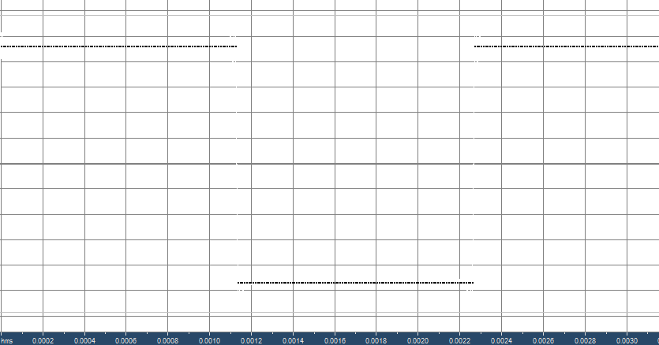
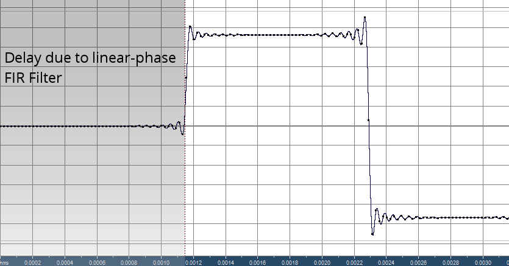

## Delay Correction in ReSampler

A natural consequence of using a linear-phase Finite Impulse Response (FIR) lowpass filter for antialiasing during the resampling process is that a time delay is introduced due to the filter's constant group delay across all frequencies.

In practice, this delay is small (of the order of 1 or 2 milliseconds).

The actual delay (in samples) is given by the following formula:

where: 

	D = Delay (in samples)

	N = length of FIR

	L = decimation factor (denominator in conversion ratio)

To correct the timing due to the delay, ReSampler discards (ie does not write to the ouptut file) samples prior to the **Dth** output sample.

This behavior appears to be the accepted practice for sample rate converters, but can nevertheless be disabled using the **--noDelayTrim** option.  

The **--noDelayTrim** option has no effect when used in conjunction with Minimum Phase, since a minimum-phase FIR should not introduce delay.

*Note: In a realtime system, removing the delay would not be possible because it would require the ability to go back in time!* 

The following illustrates the group delay introduced when a 440Hz square wave is resampled from 96kHz to 44.1kHz:

*above: 440Hz square wave at 96kHz sampling rate*

 

*above: 440Hz Square wave, resampled from 96kHz to 44.1kHz with no delay correction.*

*Grey area indicates delay due to linear phase FIR, and this grey region is trimmed off unless **--noDelayTrim** option is used*