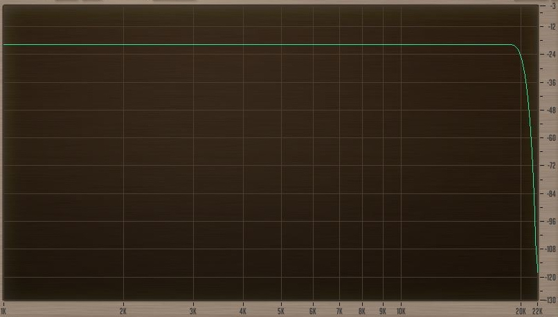
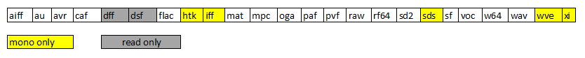
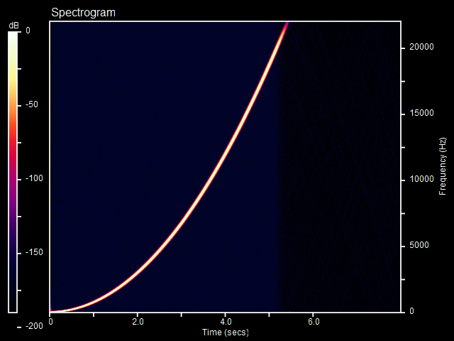

## Synopsis
ReSampler is a high-performance command-line audio sample rate conversion tool which can convert audio file formats with a variety of different bit-depths and audio channel configurations.

ReSampler compiles and runs on [Windows](windows-build.md), [Linux](linux-build.md) and [macOS](mac-build.md)

ReSampler is intended to produce outstanding quality sound files, keeping aliasing and other unwanted artifacts to a minimum, as the following actual measurement graphs show:

   
*Typical frequency response when downsampling from 96kHz to 44.1kHz with standard (default) LPF*

-dp.png)  
*Spectrogram of 0-48kHz Sine Sweep @96kHz sample rate, after having been downsampled to 44kHz sample rate*

## Motivation

* experimentation with digital filters and some basic DSP concepts
* a requirement to have a simple command-line tool to be used in a script to convert a large collection of audio files
* a need for a *quality* SRC tool, as the quality of other offerings (both commercial and free) varies wildly from terrific to appalling

## Design Philosophy

* ReSampler is first and foremost a converter. Other functionality (for example, generation of synthesised waveforms or spectrograms) is considered outside the scope of the project.
* Output file quality takes precedence over all other considerations, such as processing speed (although efforts to improve the latter will certainly be explored, they cannot be at the expense of the former)
* Core command-line options (the ones that are fundamental to performing a conversion) have a single hyphen and a single letter (eg **-r 44100**). 
* Additional options (those that *tweak* or *tune* the behavior of the program in some way) follow the GNU long option style with two hyphens and a keyword (eg **--dither**)
* Command-line options selected by the user should be echoed to the user in the converter's console output, to confirm the acceptance and application of the options
* The introduction of new features to the converter should not change the basic behaviour of the converter, or the sound of files produced by the converter, UNLESS the user explicitly invokes the new features.

## Usage

from the command line, the main options are as follows:

**resampler.exe -i inputfile [-o outputfile] -r samplerate [-b bitformat] [-n [&lt;normalization factor&gt;]]**
 
**samplerate** : target sample rate in Hz.

**bitformat** : bit representation (sub format) of the data in the output file. If this option is omitted, resampler will try to deduce the intended bit format automatically. Not all bit formats are valid for a given output file type. For more details, refer to the [libsndfile](http://www.mega-nerd.com/libsndfile/) documentation. Here is a list of all subformats: 

    8           8-bit (signed or unsigned - automatic, based on file type)
    s8          Signed 8 bit data
    16          Signed 16 bit data
    24          Signed 24 bit data
    32          Signed 32 bit data
    u8          Unsigned 8 bit data
    32f         32 bit float data
    64f         64 bit float data
    ulaw        mu-Law encoded
    alaw        A-Law encoded
    ima-adpcm   IMA ADPCM
    ms-adpcm    Microsoft ADPCM
    gsm610      GSM 6.10 encoding
    vox-adpcm   OKI Dialogix ADPCM
    g721-32     32kbs G721 ADPCM encoding
    g723-24     24kbs G723 ADPCM encoding
    g723-40     40kbs G723 ADPCM encoding
    dwvw12      12 bit Delta Width Variable Word encoding
    dwvw16      16 bit Delta Width Variable Word encoding
    dwvw24      24 bit Delta Width Variable Word encoding
    dwvwn       N bit Delta Width Variable Word encoding
    dpcm8       8 bit differential PCM (XI only)
    dpcm16      16 bit differential PCM (XI only)
    vorbis      Xiph Vorbis encoding
    alac16      Apple Lossless Audio Codec (16 bit)
    alac20      Apple Lossless Audio Codec (20 bit)
    alac24      Apple Lossless Audio Codec (24 bit)
    alac32      Apple Lossless Audio Codec (32 bit)

*Note: the **--listsubformats** option will cause the program to display the valid formats for a given file-type*

**Normalization factor** : value between **0.0** and **1.0**, with 1.0 (equivalent to 100 percent) producing the largest possible output level without clipping. Note: ReSampler will accept normalization values over 1.0, but this will certainly result in clipping, and is therefore only for experimental and testing purposes. Just using **-n** with no parameter is equivalent to **-n 1.0**

### Additional options: ###

*Note: as of version 2.0, command-line options are more "forgiving" - they are now case insensitive, and allow hyphens within the text of the option to be omitted. (However, the hyphens preceding the option are still required). This allows for variations such as the following to be possible:
**--steep-lpf** **--steeplpf** **--steep-LPF** etc*

**--help** : show usage and list additional commandline options

**--version** : display the version number of the program

**--compiler** : display compiler used to build the app

**--sndfile-version** : display the version of libsndfile library

**--listsubformats &lt;filetype&gt;** : list all valid subformats for a given *filetype*

**--showDitherProfiles** : show a list of all available dither profiles.

**--gain &lt;amount&gt;** : adjust the gain (amplification factor). 1.0 = unity gain (no amplification), -1.0 = invert signal, 0 = silence. Note: if clipping protection is enabled, gain will be automatically re-adjusted after the first pass if clipping occurs. 

Note: Setting the gain differs from applying normalization in that normalization is a type of *automatic* gain control, which sets the gain to whatever it needs to be to achieve the requested output level.

**--doubleprecision** : force ReSampler to use double-precision (64-bit floating point) arithmetic for its *internal calculations.*

**--dither [&lt;amount&gt;]** : generate **+/-amount** *bits* of dither. Dithering deliberately adds a small amount of a particular type of noise (triangular pdf with noise-shaping) prior to quantization to the output file. The goal of dithering is to reduce distortion, and allow extremely quiet passages to be preserved when they would otherwise be below the threshold of the target bit depth. Usually, it only makes sense to add dither when you are converting to a lower bit depth, for example:
 
- floating-point -> 16bit, or 8bit
- 24bit -> 16bit, or 8bit
- 16bit -> 8bit

The effect of dithering is most noticeable during extremely quiet passages (typically, in fade-outs) of the audio. If you can hear modulation effects, or "tearing" in the quietest passages of your output file, then a greater amount of dither may need to be applied. (note: in many cases, these passages are so quiet, you will need to normalize them just to hear them).

The *amount* parameter represents the number of *bits* of dither noise to be generated (prior to the noise-shaping process). The actual *level* of dither noise is equal to **+/- 2^(amount-1)** *steps*. The default for *amount* is 1.0, and it doesn't need to be an integer. Values in the range 1-6 are sensible for most situations. The noise-shaping curve may further increase the amplitude of the dither, depending on the "intensity" (overall gain) of the chosen noise-shaping curve.   
ReSampler was originally developed on Windows, but has also been successfully compiled on Linux.
**--autoblank** : when specified in conjunction with **--dither** , causes dithering to switch-off after 30,000 consecutive input samples of *silence* (< -193dB is considered silence). Dithering is re-enabled immediately upon a non-zero input sample being detected.

**--ns &lt;n&gt;** : select [dither profile](./ditherProfiles.md) from 0-13. Generally speaking, as the dither profile number increases, the noise-shaping curve gets  progressively more "intense" (higher amplitude), with the exception of profle 13 (blue noise) which is actually the most gentle profile. Dither profile 0 is completely flat (no noise shaping), and is equivalent to **--flat-tpdf**. The default dither profile (if no profile is specified) is #6 (standard), which has a moderate noise-shaping curve.

**--flat-tpdf** : when specified in conjunction with **--dither** , causes the dithering to use flat tpdf noise with no noise-shaping.

**--seed &lt;n&gt;** : when specified in conjunction with **--dither** , causes the pseudo-random number generator used to generate dither noise to generate a specific (repeatable) sequence of noise associated with the number n.
Using the same value of n on subsequent conversions should reproduce precisely the same result. n is a signed integer in the range -2,147,483,648 through 2,147,483,647.  

**--quantize-bits &lt;number of bits&gt;** : when used in conjunction with **--dither**, quantize the output to a specified number of bits.
(eg. quantize to 8 bits when output is really 16 bits)

**--noDelayTrim** : deactivate correction of [delay due to the linear-phase FIR anti-aliasing filter.](./GroupDelayCorrection/delayCorrection.md)
*By default, delay correction is active to ensure that the timing of the converted output file matches the timing of the input file precisely.*

**--minphase** : use a minimum-phase FIR filter, instead of Linear-Phase

**--flacCompression  &lt;compressionlevel&gt;** : set the compression level for flac output files (between 0 and 8)

**--vorbisQuality &lt;quality&gt;** : set the quality level for ogg vorbis output files (between -1 and 10)

**--noClippingProtection** : disable clipping protection (clipping protection is normally active by default)

**--relaxedLPF** : cause the lowpass filter to use a "late" cutoff frequency with regular (hence "relaxed") steepness. 
(cutoff = 95.45% of Nyquist, transition width = 9.09% of Nyquist). 
This will (theoretically) allow a small amount of aliasing, but at the same time, keep ringing to a minimum and maintain a good frequency response.

**--steepLPF** : cause the lowpass filter to use a steeper cutoff (cutoff = 95.45% of Nyquist, transition width = 4.55% of Nyquist). It avoids aliasing, but may result in more ringing.

**--lpf-cutoff &lt;percentage&gt;** : set a custom cutoff frequency for the lowpass filter, expressed as a percentage of Nyquist Frequency. Allowable range: 1.0 - 99.9. 
Overrides --relaxedLPF and --steepLPF

**--lpf-transition &lt;percentage&gt;** : when used in conjunction with **--lpf-cutoff**, set the transition width of the lowpass filter, expressed as a percentage of Nyquist frequency. 

**--mt** : Multi-Threading - process each channel in a separate thread. 
On a multi-core system, this makes better use of available CPU resources and results in a significant speed improvement.  

**--rf64** : force output .wav file to be in rf64 format. Has no effect if output file is not a .wav file.

*Note: If your output file has an .rf64 extension, it will automatically be in rf64 format*

**--noPeakChunk** : suppress output of PEAK chunk in floating-point formats

**--noMetadata** : prevent copying of metadata from input file to output file. 

*By default, ReSampler will attempt to copy native metadata from the input file to the output file, provided the input and output file types support metadata 
(ie: wav, aiff, caf, flac, oga, rf64)*

**--singleStage** : use single-stage conversion engine (significantly less efficient and therefore slower, but "simpler" conversion)

**--multiStage** : use multi-stage conversion engine

**--showStages** : show details about the parameters used for each conversion stage.

**--showTempFile** : (Windows Only) show the path and filename of the temp file

**--tempDir &lt;path&gt;** : (Windows Only) specify temp directory for the temp file, instead of the default (%temp%). Directory must already exist.

**--noTempFile** : disable the creation of a temporary file during conversion. 
(By default, a temp file is created, containing intermediate conversion results in floating-point format. 
The temp file is used to facilitate fast gain adjustment when clipping is detected, and is deleted after the output file has been written. If the creation of a temp file is disabled,
the entire conversion will need to be performed again if clipping is detected. 
*Note: versions of Resampler prior to 2.0.3 did not use a temporary file*)

**--raw-input &lt;samplerate&gt; &lt;bit-format&gt; [number of channels]** : read raw input data (ie with no header). Since there is no header, you must specify the sample rate, bit format, and number of channels of the input file using the syntax above. If the number of channels is omitted, single-channel (mono) input is assumed. Accepted bit formats for raw input are: 8, s8, u8, 16, 24, 32, 32f, 64f, alaw, ulaw, gsm610, dwvw12, dwvw16, dwvw24, vox-adpcm

**--progress-updates &lt;0..100&gt;** : number of progress update notifications to be sent by the converter throughout the conversion. (0 = no updates, 100 = every 1% etc). Default is 10

#### Example

To convert a 96kHz 24-bit .wav input file to 44.1kHz 16-bit .flac output file, with steep lowpass filter and dithering:

~~~
ReSampler.exe -i c:\pathto\somefile.wav -o c:\pathto\convertedfile.flac -r 44100 -b 16 --steepLPF --dither
~~~

*note: command-line options can be supplied in any order. The -i inputfile and -r samplerate options are mandatory in order to perform a conversion.*

## Supported Formats

Resampler can handle any of the file formats libsndfile can handle, plus a few extras (notably, the 1-bit DSD formats, dff and dsf). 
Thus, the following file extensions are supported:  

For more information, please refer to the [libsndfile documentation](http://www.mega-nerd.com/libsndfile/)

(since v2.0.7) ReSampler can also export audio data to a csv file. 
The data for each channel is placed in a separate column, and each row represents a sample.
To do this, set the file extension of the output file to **.csv** and specify an output format
with the **-b** option followed by a bit format specification of the form **[u|s]&lt;num of bits&gt;[f|i|o|x]** 
where u = unsigned, s = signed, f = float, i = integer, o = octal, x = hexadecimal.
(if the **-b** option is omitted, then the default will be 16 bit signed integer) 

## Additional Information

#### Clipping Protection

Resampler employs a multiple-pass approach with regards to clipping detection. If clipping is detected (ie normalized signal level exceeded +/- 1.0) during processing, it will re-do the conversion with the overall gain adjusted appropriately to avoid clipping. (This can be disabled with the **--noClippingProtection** option)

#### Double Precision vs Single Precision

When *Double Precision* is engaged (using the **--doubleprecision** option), all calculations inside the conversion will be done using double-precision (64-bit) floating-point instead of single-precision (32-bit). Typically, the most noticeable effect of this is that the noise floor is significantly reduced. This can be observed in spectrograms of frequency sweeps, which were converted from 96khz to 44.1khz:

<table>
    <thead>
        <tr>
            <th>Single Precision:</th>
            <th>Double Precision:</th>
        </tr>
    </thead>
    <tbody>
        <tr>
            <td></img></td>
            <td></img></td>
        </tr>
    </tbody>
</table>

*In the above comparison, the "blue haze" seen in the single-precision conversion is the result of quantization noise from rounding errors in single-precision arithmetic. The double-precision conversion is noticeably cleaner. Please note, however, that even with single precision, the noise is sitting about 150dB down, and will not be reproduced by any real-world DAC, and therefore will not be audible.*

There is a penalty in processing speed for converting using double precision, and it is to be expected that double-precision conversions take longer to process.  

#### Conversion to same sampling rate

When the target sampling rate is the same as the input file (ie 1:1 ratio), sample-rate conversion is not actually performed. However, bit-depth / file format conversion and other features such as dithering and normalization are performed when requested.

#### Automatic promotion of **wav** files to **rf64** format

For **wav** file output, if the data contained in the output file will exceed 4 Gigabytes after conversion, ReSampler will automatically "promote" the file format to **rf64** 

*Traditional wav files only have 32-bits to quantify the size of the data they contain, which means that the data size cannot exceed 4 Gigabytes (2^32 bytes). The [rf64 specification](https://tech.ebu.ch/docs/tech/tech3306-2009.pdf) was designed to extend the wav format to remove this limitation.*

Alternatively, other output formats suitable for *large* output files (exceeding 4GB) are: **w64, caf, au** or compressed formats such as **flac** or **oga**

Note: the **--rf64** option will force output .wav files to be in rf64 format.   

## Description of code
 
Sample Rate Conversion is accomplished using the usual interpolation/decimation techniques. When using complex conversion ratios (such as 44.1k <--> 48k), a larger FIR lowpass filter is used to ensure a clean conversion.

Resampler uses the C++ wrapper of the [libsndfile](http://www.mega-nerd.com/libsndfile/) library for sound file I/O operations.

The FIR filter class written for this project uses SSE SIMD instructions when using single-precision floating-point to perform 4 multiply/accumulate operations simultaneously. This has been found to yield a speed improvement of approximately 3x. Some experimentation was also done with 2x double-precision SSE2 SIMD, but was found to be no faster than the basic scalar implementation, and has thus been commented-out (but not deleted) from the source.

(Additionally, some progress has been made recently with a build of the project using AVX instructions, on supported CPUs / OSes, to perform 8 single-precision or 4 double-precision multiply/accumulate operations at a time.) 

Resampler was originally developed on Visual C++ 2015, but also compiles just as well on gcc and clang.

#### explanation of source code files:

----------

**resampler.cpp** :	core of program

**resampler.h** : important data structures and function declarations

**FIRFilter.h** : FIR Filter DSP code

**FIRFilterAVX.h** : AVX-specific DSP code (conditional #include in AVX build)

**fraction.h** : defines Fraction type, and functions for obtaining gcd, simplified fractions, and prime factors of integers
 
**srconvert.h** : the heart of the sample rate conversion process

**biquad.h** : IIR Filter (used in dithering)

**ditherer.h** : defines ditherer class, for adding dither

**noiseshape.h** : contains definitions of noise-shaping curves

**dff.h** : module for reading dff files

**dsf.h** : module for reading dsf files

**alignedmalloc.h** : simple function for dynamically allocating aligned memory (AVX requires 32-byte alignment)

**osspecific.h** : contains macro definitions for specific target operating systems

**raiitimer.h** : simple timer which displays elapsed time upon going out of scope

*(the class implementations are header-only)*

----------

## compiling ReSampler

[Windows](windows-build.md)

[Linux](linux-build.md)

[Mac](mac-build.md)

[Raspbian](rpi-build.md)

----------

## Description of Binaries included in distribution

**ReSampler/Release/ReSampler.exe** : 32-bit Windows with **SSE2** instruction set

**ReSampler/x64/Release/ReSampler.exe** : 64-bit Windows (*uses SSE2, but all 64-bit CPUs should have this*)

**ReSampler/x64/AVX_Release/ReSampler.exe** : 64-bit Windows with **AVX** instruction set (Requires Intel *Sandy Bridge* CPU or higher, AMD *Bulldozer* or higher. Requires Windows 7 SP1 or higher, Windows Server 2008 R2 SP1 or higher OS) 

**Resampler/x64/mingGW-W64** : 64-bit windows version, compiled in mingw-w64 gcc compiler (runs about 20% faster !)

**Resampler/x64/mingGW-W64-AVX** : 64-bit AVX windows version, compiled in mingw-w64 gcc compiler (runs about 20% faster !)

----------

## Acknowledgements

#### The following libraries are used in ReSampler:

<table>
    <thead>
        <tr>
            <th>Name</th>
            <th>Description</th>
            <th>Reason For Inclusion</th>
            <th>Link</th>
            <th>License</th>
        </tr>
    </thead>
    <tbody>
        <tr>
            <td>libsndfile</td>
            <td>C library for reading and writing files containing sampled sound</td>
            <td>Core read/write capabilities for common file formats</td>
            <td><a href="http://www.mega-nerd.com/libsndfile/">libsndfile</a></td>
            <td>LGPL 2.1</td>
        </tr>
        <tr>
            <td>FFTW</td>
            <td>C subroutine library for computing the discrete Fourier transform (DFT)</td>
            <td>used for conversion of linear-phase impulses to minimum-phase</td>
            <td><a href="http://www.fftw.org/">fftw</a></td>
            <td>GPL (2?)</td>
        </tr>
        <tr>
            <td>CTPL</td>
            <td>Modern and efficient C++ Thread Pool Library</td>
            <td>Used for multi-threaded sample-rate conversion</td>
            <td><a href="https://github.com/vit-vit/CTPL">CTPL</a></td>
            <td>Apache 2.0</td>
        </tr>
    </tbody>
</table>

#### Thanks to the following github users for their [contributions](https://github.com/jniemann66/ReSampler/graphs/contributors):

[@mgood7123](https://github.com/mgood7123)

[@godsic](https://github.com/godsic)
